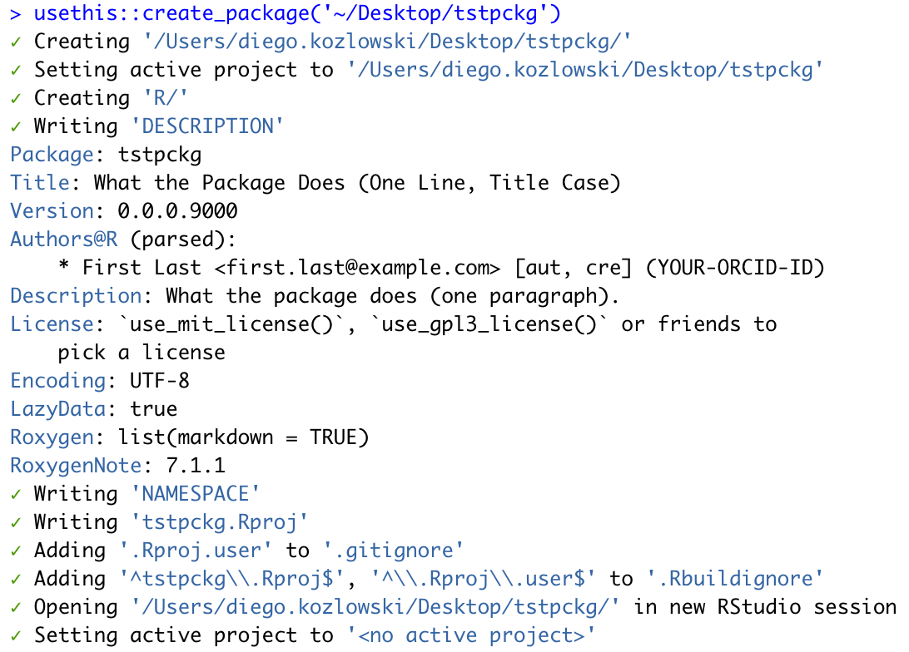
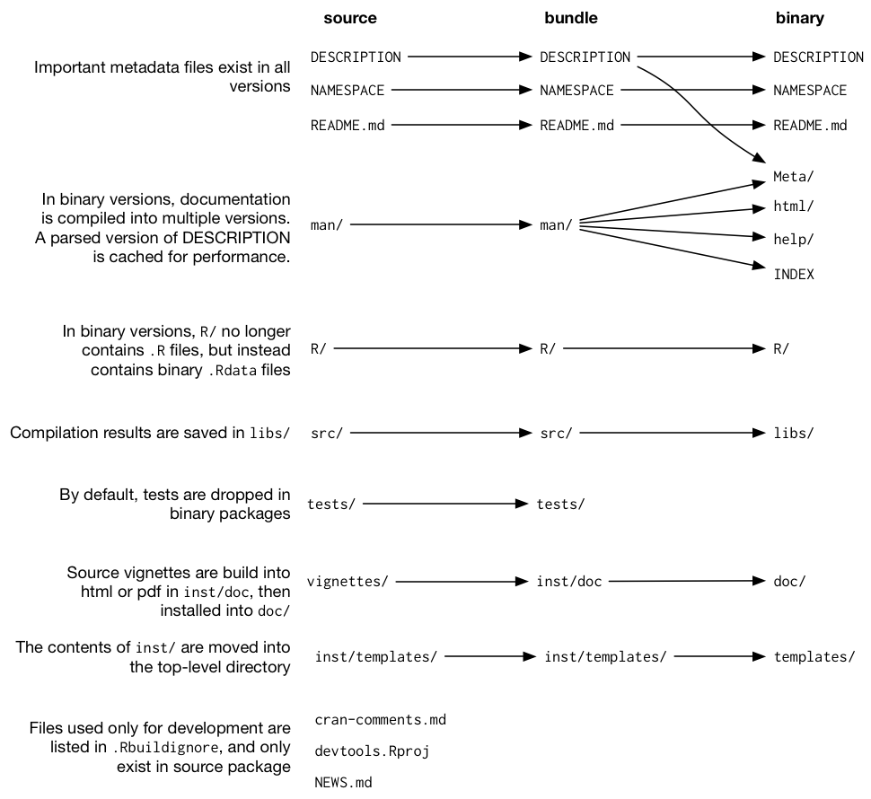
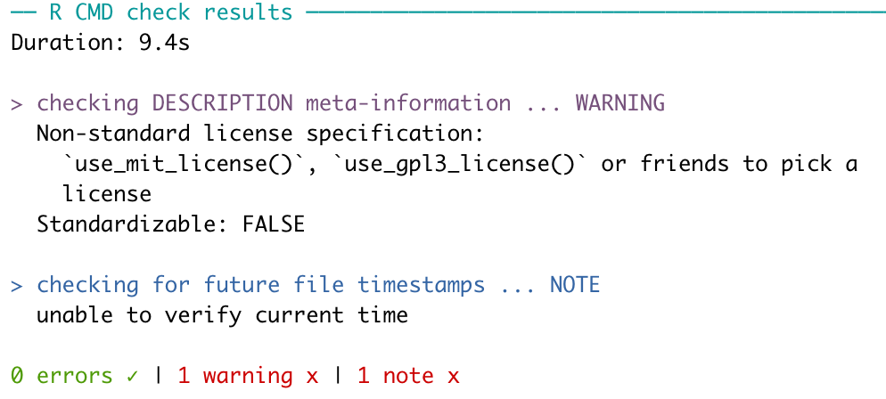
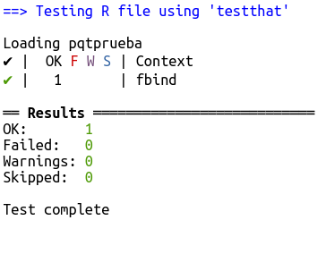
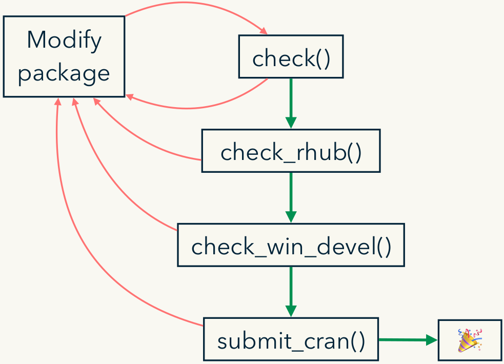

The goal of this talk is to introduce the use of tools that simplify the development of packages in R. It's a free and summarized interpretation of the course prepared by:

  * Jenny Bryan [jennybryan.org](https://jennybryan.org) \| GitHub [jennybc](https://github.com/jennybc) \| Twitter [jennybryan](https://twitter.com/jennybryan)
  * Jim Hester [jimhester.com](https://www.jimhester.com) \| GitHub [jimhester](https://github.com/jimhester) \| Twitter [jimhester_](https://twitter.com/jimhester_)
  * Hadley Wickham [hadley.nz](http://hadley.nz) \| GitHub [hadley](https://github.com/hadley) \| Twitter [hadleywickham](https://twitter.com/hadleywickahm)


> The original materials can be found at [https://github.com/hadley/pkg-dev](https://github.com/hadley/pkg-dev)

We are going to make a toy package, following [this chapter](https://r-pkgs.org/whole-game.html)

## Setup

> All code in these class notes should not be run in the .rmd but in the package environment

```r
install.packages(c(
  "devtools", "roxygen2",
  "testthat", "covr", "pkgdown"
))
usethis::use_course("http://bit.ly/pkg_dev")
```

# Basic Workflow

## usethis

The main tool for creating an R-package is `usethis`, a package that contains a set of functions that simplify the work


### We created the package with `create_package()`

This creates the directory with the basic structure of the package

```r
usethis::create_package('~/Desktop/tstpckg')
```




### We create our function

Example. We want a function that concatenates factors with properties that are cooler than the default

```{r}
a <- factor(c("character", "in", "the", "streets"))
b <- factor(c("integer", "in", "the", "sheets"))

c(a,b)
factor(c(as.character(a), as.character(b)))
```


We create the function  `fbind`

```{r}
fbind <- function(a, b) {
factor(c(as.character(a), as.character(b)))
}
```


To add it into the package we use `usethis::use_r("file-name")`

```r
usethis::use_r("fbind")
```

- We write our function in R/fbind.R

- With `devtools::load_all()` (or ctrl+shift+L) we can load the functions of the package for testing on the console. 

> We have our function that does what we want. What now?

## We check the package


`Check` analyses the package to find possible `errors`, `warnings` or `notes`. These are three levels of severity of the problems presented by the package.

- For a package to be accepted in CRAN it must have neither errors nor warnings, and the notes are inspected by the reviewers (in general there is a note for packages that are uploaded for the first time, and there should be no others than this one).

- It is important to run many checks throughout the development of the package and keep it clean. It is better to solve the problems as soon as they appear.

```r
devtools::check()
```

We can also run them from  `Build --> Check.`

What does it return?




This indicates that:
 
 - We did not specify the package license
 - We did not create the documentation for the function `fbind`
 
To create the license we can use `usethis::use_mit_license(name = 'Your Name')` function

 
### Documentation

To create the documentation we use the `devtools::document()` function or ctrl+shift+D and the  [roxygen2](https://cran.r-project.org/web/packages/roxygen2/vignettes/roxygen2.html) package
 

> We stand on the function --> Code --> Insert roxygen skeleton

## Install.

Once the package works, we can use `devtools::install()` to install and use it

# Testing


It is important to add automatic tests to our package, so that every time we make a change, the tests automatically check that another part of the package has not been broken.

To do this, we use the `use_test` function which creates a new script in the tests/testthat folder where we can write our tests

```r
usethis::use_test('fbind')
```

For example, for 'fbind' we could set up the following test

```r
test_that("fbind works", {

  factor1 <- factor(c('Hi','there'))
  factor2 <- factor(c('we', 'are', 'testing', 'this', 'function'))
  expect_equal(fbind(factor1,factor2),
               factor(c('Hi','there','we', 'are', 'testing', 'this', 'function')))
})

```

Here we use the `test_that` function to build the test, and inside it, `expect_equal` to indicate that the result of the fbind should be such a factor. 

In the test script we have the _run tests_ button at the top right. The result is:





This indicates that the test is working properly.

> Now every time we do a check, it will also run all the tests. 

## Workflow:


## Coverage

The test coverage indicate the proportion of the code that is covered by tests. Not all code is easily testable, but a high coverage is a guarantee that there are no hidden problems. (in the original notes there is a detail explanation on how to check coverage)

# Sharing the package

Having your own package can help us avoid copying functions to each script. But if the package is useful for us, it will probably be also useful for other people and we will want to share it.

To this end, we will look at three ways of sharing our work

1. GitHub package
2. Vignettes
3. pkgdown
4. submit to CRAN


## Github package

There are many ways to create a repository on Github.

- The simplest option is to create an empty repo from the GitHub page, clone it and then paste what we already have into that folder.
-  We can also use the functions of the package `usethis` `use_git()` y `use_github()`. 


```r
usethis::use_git()

usethis::use_github()
```
and from the terminal

```terminal
git push --set-upstream origin master
```

The first function defines our folder as a git repo. The second creates a GitHub repository. Finally the third one defines the upstream of our repo and pushes the content it has.

For this to work we have to have previously synchronized our computer with a GitHub session. We can do this from are with `usethis::browse_github_token()` to generate a authorization from GitHub and then add it to R with `usethis::edit_r_environ()`


For example, for me, these commands created the following repo: [https://github.com/DiegoKoz/tstpckg](https://github.com/DiegoKoz/tstpckg)

### Workflow on GitHub

Once our package is in GitHub, we should upload the functions updates with:

1. Add
2. Commit
3. Push

- This is just the basic flow of GitHub and there are many more things that can be done. But for now we restrict it to this minimum. We can do this from the terminal or from the Rstudio IDE. 

- A good place to read more about Git and Github with an R is [https://happygitwithr.com/](https://happygitwithr.com/)

For the bookstore to have a good presentation, we should add a README.

```r
usethis::use_readme_rmd()
```
After modifying the readme, we have to upload it to GitHub again!

## Vignette

If we want people to use our package, it is best that the documentation makes it easy to understand what it does and what it is for. 

To create a vignette we can use the following command

```r
usethis::use_vignette(name = 'vignette_test',title = 'Example of Vignette')
```

- Don't forget to commit it!


## pkgdown


Now what we want is for our package to have its own website

For this, we use the package [pkgdown](https://pkgdown.r-lib.org/)

```r
pkgdown::build_site()
```

It does everything for us!!

{width=500}

This creates a docs/ folder in the repo, with all the materials of the page.  What we need now is to publish the page from GitHub. For that, we're going to

1. Settings
2. GitHub Pages
3. Source --> master branch /docs folder

For me, this generates the [https://diegokoz.github.io/tstpckg/](https://diegokoz.github.io/tstpckg/) webpage


## Submit a CRAN

{width=500}

When a package is in CRAN it is because it was properly reviewed and its performance can be trusted. This implies that in order to upload our repository to CRAN we must meet several requirements.

- The description file must be duly completed with:
  - Title, 
  - Version number updated (for this, we can use ` usethis::use_version()`)
  - Authors
  - Description
  - Dependencies (Imports: the packages that our package uses)
  - BugReports

- The bookstore should not have any errors, warnings or notes when we check it.
- In addition, we can do external checks with

```r
devtools::check_rhub()
devtools::check_win_devel()
```


- If all forms of checking work well, we can consider uploading it to CRAN.

- For that, we first use `usethis::use_cran_comments()` to create the file with comments for the CRAN reviewer. 

- If rejected, we incorporate the reviewer's comments and in the cran-comments.md file we add

```
This is a resubmission. Compared to the last submission, we have:
* First change.
* Second change.
* Third change

---
```


